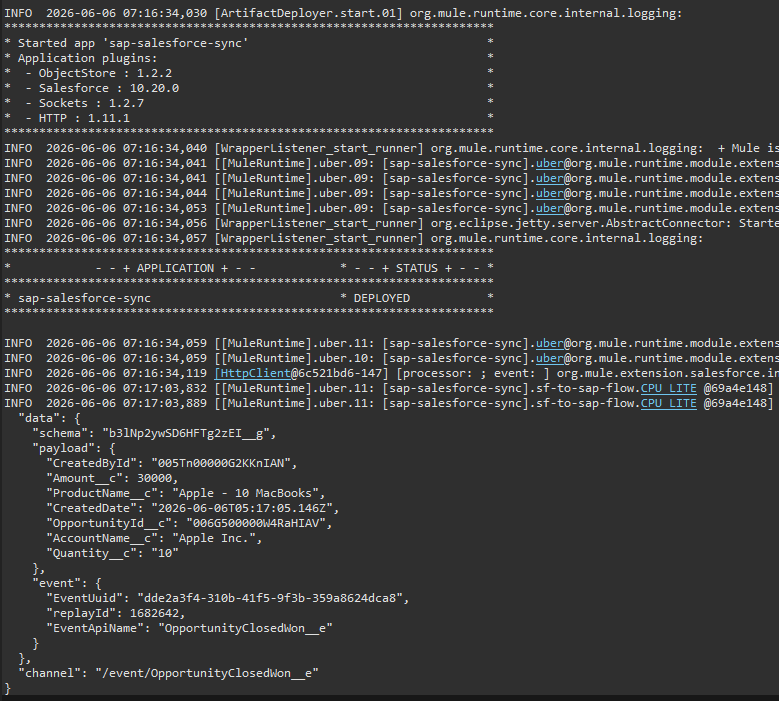

# sap-integration-sync

Bidirectional SAP S/4HANA ↔ Salesforce integration via MuleSoft Anypoint Studio.

## Overview

This project implements a full bidirectional integration between SAP S/4HANA and Salesforce using MuleSoft as the middleware layer. It covers two integration flows, with a closed feedback loop on the outbound side:

- **SAP → Salesforce**: Fetches Sales Orders from the SAP S/4HANA OData V2 API and creates custom `SAP_Order__c` records in Salesforce
- **Salesforce → SAP**: Listens to Salesforce Platform Events (`OpportunityClosedWon__e`), creates a Sales Order in SAP when an Opportunity is closed, then writes the returned SAP order number back onto the Opportunity

## Architecture

```
SAP S/4HANA (OData V2)
        |
        |  curl --compressed (gzip handling)
        v
MuleSoft HTTP Listener (port 8083)
        |
        |  DataWeave 2.0 transformation
        v
Salesforce SAP_Order__c (custom object)


Salesforce Opportunity (Closed Won)
        |
        |  Platform Event: OpportunityClosedWon__e
        v
MuleSoft Salesforce Connector (subscribe-channel-listener)
        |
        |  DataWeave 2.0 transformation
        v
SAP Sales Order creation (simulated endpoint port 8084)
        |
        |  returned SAP order number
        v
MuleSoft updates Opportunity.SAP_Order_Number__c
```

## Tech Stack

- **MuleSoft Anypoint Studio** 7.24 — runtime 4.11.4
- **SAP S/4HANA** OData V2 API (`API_SALES_ORDER_SRV`)
- **Salesforce** Platform Events, Custom Objects, SOAP API
- **DataWeave 2.0** — field mapping and transformation
- **Java 17** — runtime environment

## Project Structure

```
sap-integration-sync/
├── src/
│   └── main/
│       ├── mule/
│       │   └── sap-salesforce-sync.xml    # Main flow definitions
│       └── resources/
│           └── config.yaml               # Externalized credentials (gitignored)
├── pom.xml
└── README.md
```

## Flows

### 1. `sap-to-salesforce-flow`
- **Trigger**: HTTP POST on `localhost:8083/sap/orders`
- **Input**: SAP OData V2 JSON response (`d.results` array)
- **Processing**: DataWeave maps SAP fields to Salesforce custom object fields
- **Output**: Creates `SAP_Order__c` records in Salesforce

**Field mapping:**

| SAP Field | Salesforce Field |
|---|---|
| `SalesOrder` | `SAP_Order_Number__c` |
| `SoldToParty` | `SAP_Customer_ID__c` |
| `SalesOrderType` | `SAP_Order_Type__c` |
| `TotalNetAmount` | `SAP_Total_Amount__c` |
| `TransactionCurrency` | `SAP_Currency__c` |
| `OverallDeliveryStatus` | `SAP_Delivery_Status__c` |

### 2. `sf-to-sap-flow`
- **Trigger**: Salesforce Platform Event `OpportunityClosedWon__e`
- **Processing**:
  1. Stores the Opportunity Id in a variable (`data.payload.OpportunityId__c`)
  2. DataWeave maps Opportunity data to SAP Sales Order format
  3. POSTs the payload to the SAP simulator endpoint
  4. Captures the SAP order number from the response
  5. Updates the originating Opportunity with `SAP_Order_Number__c`
- **Output**: SAP Sales Order created + Opportunity enriched with its SAP reference

### 3. `sap-simulator-flow`
- **Trigger**: HTTP POST on `localhost:8084/sap/create`
- **Purpose**: Simulates the SAP S/4HANA write endpoint (the public sandbox is read-only)
- **Output**: Returns a generated SAP Sales Order number

## Setup

### Prerequisites
- MuleSoft Anypoint Studio 7.24+
- Java 17
- Salesforce Developer/Sandbox org
- SAP API Hub account — [api.sap.com](https://api.sap.com)

### Configuration

Create `src/main/resources/config.yaml`:

```yaml
salesforce:
  username: "your-sf-username"
  password: "your-sf-password"
  token: "your-sf-security-token"

sap:
  apikey: "your-sap-api-key"
```

### Salesforce Setup

Create the following custom object:

**Object**: `SAP_Order__c`

| Field Label | API Name | Type |
|---|---|---|
| SAP Order Number | `SAP_Order_Number__c` | Text (255) — External ID |
| SAP Customer ID | `SAP_Customer_ID__c` | Text (255) |
| SAP Order Type | `SAP_Order_Type__c` | Text (50) |
| SAP Total Amount | `SAP_Total_Amount__c` | Currency |
| SAP Currency | `SAP_Currency__c` | Text (10) |
| SAP Delivery Status | `SAP_Delivery_Status__c` | Text (10) |

Add a custom field on the **Opportunity** object to store the SAP reference returned by the outbound flow:

| Field Label | API Name | Type |
|---|---|---|
| SAP Order Number | `SAP_Order_Number__c` | Text (50) |

Create the Platform Event `OpportunityClosedWon__e` with fields:
- `OpportunityId__c` (Text 255)
- `AccountName__c` (Text 255)
- `Amount__c` (Number)

A record-triggered Flow on Opportunity publishes this event when `StageName = Closed Won`, mapping `OpportunityId__c` to the Opportunity record Id.




### Running the Integration

**SAP → Salesforce:**
```bash
curl --compressed "https://sandbox.api.sap.com/s4hanacloud/sap/opu/odata/sap/API_SALES_ORDER_SRV/A_SalesOrder?\$top=10&\$format=json" \
  -H "APIKey: YOUR_API_KEY" \
  -H "DataServiceVersion: 2.0" \
  -H "Accept: application/json" | curl -X POST http://localhost:8083/sap/orders \
  -H "Content-Type: application/json" \
  -d @-
```

**Salesforce → SAP:**

Move an Opportunity to **Closed Won** in Salesforce. The Platform Event fires automatically, MuleSoft creates the SAP order, and the returned SAP number is written back onto the Opportunity.

## Key Technical Challenge: SAP Sandbox Gzip Compression

The SAP sandbox compresses all responses with gzip regardless of the `Accept-Encoding: identity` header. The MuleSoft modules that could decompress in-flow (Scripting, Compression) do not support Java 17, which the 4.11 runtime requires — and downgrading the runtime to Java 11 broke startup. This created a circular dependency with no in-flow fix on this runtime.

**Solution**: `curl` natively decompresses gzip with the `--compressed` flag. Piping the SAP response through curl into a second POST to the MuleSoft HTTP Listener delivers clean JSON to the flow.

```bash
curl --compressed [SAP endpoint] | curl -X POST [MuleSoft listener] -d @-
```

**Production note**: this is a POC-stage workaround. A production version would resolve decompression natively inside MuleSoft (compatible runtime/Java/module combination) and replace the manual curl step with a scheduler plus OData pagination (`$top` / `$skip`) for full automated sync.

## Companion Project

The Salesforce-side dashboard (LWC + Apex) that visualizes both integration directions lives in a separate repository: **sap-integration-dashboard**.

## Author

**Karim Tayassi** — Salesforce Developer
[LinkedIn](https://linkedin.com/in/karim-tayassi) · [GitHub](https://github.com/KarterKiller)